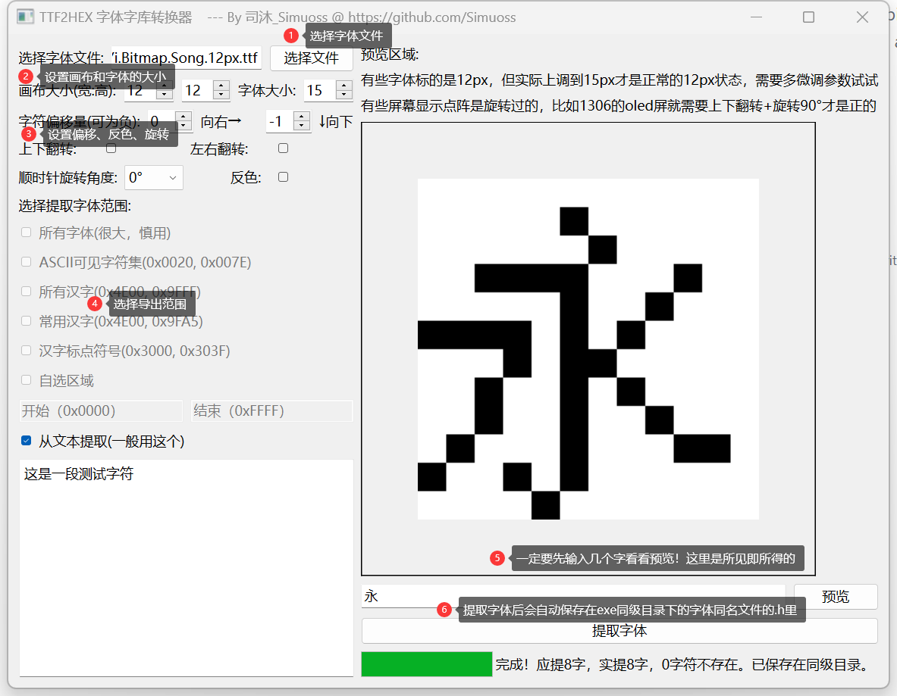

<div align="center">
    <h1> THE —— TTF2HEX_Extractor | MCU Font Extractor </h1>
</div>

<div align="center">  
    
    
    

【[简体中文](./readme.md)】         【[English](./readme_en.md)】 
    
</div>

## 📖 Introduction

THE —— TTF2HEX_Extractor_MCU Font Extractor is a tool to convert TTF font files into fonts suitable for use on microcontrollers. It converts TTF font files into a C language format header file for microcontroller fonts.

The motivation behind developing this software was the desire to display Chinese characters on an OLED screen. Manually inputting HEX one by one for each character was too cumbersome, so the idea was to write software to automatically generate font header files.

### 🧰 Features List

- [x] Support for TTF font files
- [x] Adjustable canvas and font size
- [x] Support for shifting, rotating, mirroring, and inverting
- [x] WYSIWYG character preview
- [x] Progress bar to display the generation progress
- [x] Output to a .h C language format font header file
- [ ] Support for more font file formats
- [ ] Multi-language support
- [ ] Select fonts from local/network font libraries
- [ ] Image to HEX conversion
- [ ] Add auto-fit width and height mode
- [ ] Custom screen size preview for text to be converted
- [ ] Add support for mathematical symbols, emojis, etc.
- [ ] Interface beautification
- [ ] Code refactoring

## ✨ Quick Start

### Usage
1. Prepare one or more TTF font files; pixel fonts are recommended for better extraction results.
2. Download the latest **[release](https://github.com/Simuoss/THE-TTF2HEX_Extractor/releases)** version.
3. Run the **.exe** file, select the font file, set parameters such as font size, canvas size, etc., preview to confirm correctness, and click the **提取字体** button.
   
4. Export format:
    ```c
    #ifndef __WENQUANYI_BITMAP_SONG_12PX_TTF_FONT_H__
    #define __WENQUANYI_BITMAP_SONG_12PX_TTF_FONT_H__

    const unsigned char code F_zh_cn_8x8[][8] = {
        // \u8fd9: 这
        {0x00, 0x42, 0x84, 0xF0, 0x07, 0x24, 0x44, 0x84, 0x44, 0x34, 0x0A, 0xF1, },
        // \u662f: 是
        {0x00, 0xF8, 0x08, 0xF8, 0x08, 0xF8, 0x00, 0xFF, 0x24, 0xE4, 0x2A, 0xF1, },
        // \u4e00: 一
        {0x00, 0x00, 0x00, 0x00, 0x00, 0x00, 0xFF, 0x00, 0x00, 0x00, 0x00, 0x00, },
        // \u6bb5: 段
        {0x00, 0xD8, 0x46, 0x42, 0x2E, 0x02, 0xEE, 0x22, 0x42, 0x8F, 0x42, 0x32, },
        // \u6d4b: 测
        {0x00, 0x7D, 0x46, 0x54, 0x55, 0x56, 0x54, 0x54, 0x13, 0x2A, 0x46, 0x02, },
        // \u8bd5: 试
        {0x00, 0x82, 0x84, 0xF8, 0x80, 0xF7, 0xA4, 0xA4, 0x24, 0x64, 0x1C, 0x04, },
        // \u5b57: 字
        {0x00, 0x20, 0xFE, 0x02, 0xF9, 0x40, 0x20, 0xFF, 0x20, 0x20, 0x20, 0x38, },
        // \u7b26: 符
        {0x00, 0x84, 0xBC, 0x4A, 0x21, 0x08, 0xF4, 0x06, 0x25, 0x44, 0x04, 0x84, },
    };

    #endif
    // 提取完成，应提取8个字符，实际提取8个字符，有0个字符不在字体里。
    ```
    Special thanks to and recommendation of [文泉驿点阵体](https://github.com/AmusementClub/WenQuanYi-Bitmap-Song-TTF), which is used for demonstration. **Pay attention to the LICENSE when using**.

### Development
1. Clone the project locally
    ```shell
    git clone git@github.com:Simuoss/THE-TTF2HEX_Extractor.git
    ```
2. Open the command line in the directory and install dependencies (mainly Pyslide6)
    ```shell
    pip install -r requirements.txt
    ```
3. Open the project in your IDE and start development.
    > **main.py** : Main program entry  
    >> **extractor.py** : QT interface and interface logic processing  
    >> **woker.py** : Font extractor  
    >> **in_font.py** : A function to determine if the font is in the font file
