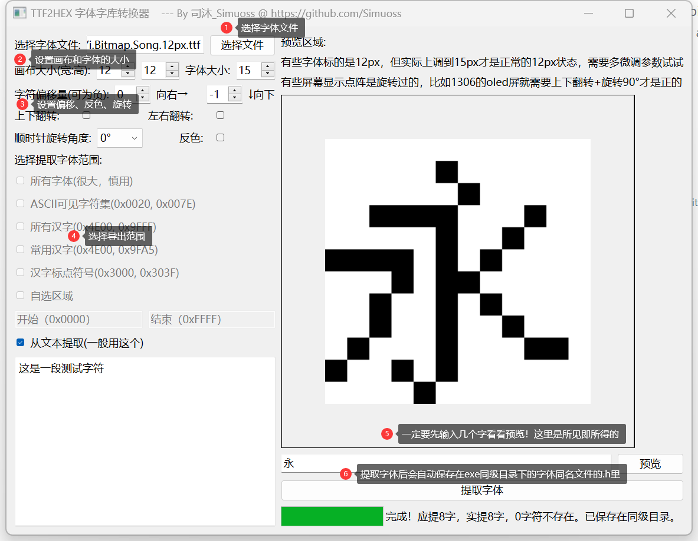

<div align= "center">
    <h1> THE —— TTF2HEX_Extractor | 单片机字库提取器 </h1>
</div>

<div align= "center">  
    
    
    

【[简体中文](README_zh.md)】         【[English](README.md)】  
</div>  

## 📖 介绍

THE —— TTF2HEX_Extractor_单片机字库提取器是一个可以将ttf字体文件转换为单片机字库的工具。它可以将ttf字体文件转换为单片机字库的C语言格式头文件，以便于在单片机上使用。

写这个软件的初衷是因为想在oled屏幕上显示中文，而一个一个字码的手动输入HEX实在是太麻烦了，所以就想着写一个软件来自动生成字库头文件。

### 🧰 特性列表

- [x] 支持ttf字体文件  
- [x] 画幅、字体大小可调
- [x] 支持位移、旋转、镜像、反色
- [x] 所见即所得字符预览
- [x] 进度条显示生成进度
- [x] 输出为.h的C语言格式字库头文件
- [ ] 支持更多字体文件格式  
- [ ] 多语言支持
- [ ] 从本地/网络字体库选择字体  
- [ ] 图片转HEX  
- [ ] 添加自动适配宽高模式
- [ ] 自定义屏幕尺寸预览待转文字  
- [ ] 添加数学符号、emoji等选区支持  
- [ ] 美化界面  
- [ ] 重构代码 

## ✨ 快速开始

### 使用
1. 准备一款或多款ttf字体文件，推荐像素字体，提取出来效果比较好
2. 下载最新的 **[release](https://github.com/Simuoss/THE-TTF2HEX_Extractor/releases)** 版本
3. 运行 **.exe** 文件，选择字体文件，设置字体大小、画幅大小等参数，预览确认无误后点击 **提取字体** 按钮
   
4. 导出格式：
    ```c
    #ifndef __WENQUANYI_BITMAP_SONG_12PX_TTF_FONT_H__
    #define __WENQUANYI_BITMAP_SONG_12PX_TTF_FONT_H__

    const unsigned char code F_zh_cn_8x8[][8] = {
        // \u8fd9: 这
        {0x00, 0x42, 0x84, 0xF0, 0x07, 0x24, 0x44, 0x84, 0x44, 0x34, 0x0A, 0xF1, },
        // \u662f: 是
        {0x00, 0xF8, 0x08, 0xF8, 0x08, 0xF8, 0x00, 0xFF, 0x24, 0xE4, 0x2A, 0xF1, },
        // \u4e00: 一
        {0x00, 0x00, 0x00, 0x00, 0x00, 0x00, 0xFF, 0x00, 0x00, 0x00, 0x00, 0x00, },
        // \u6bb5: 段
        {0x00, 0xD8, 0x46, 0x42, 0x2E, 0x02, 0xEE, 0x22, 0x42, 0x8F, 0x42, 0x32, },
        // \u6d4b: 测
        {0x00, 0x7D, 0x46, 0x54, 0x55, 0x56, 0x54, 0x54, 0x13, 0x2A, 0x46, 0x02, },
        // \u8bd5: 试
        {0x00, 0x82, 0x84, 0xF8, 0x80, 0xF7, 0xA4, 0xA4, 0x24, 0x64, 0x1C, 0x04, },
        // \u5b57: 字
        {0x00, 0x20, 0xFE, 0x02, 0xF9, 0x40, 0x20, 0xFF, 0x20, 0x20, 0x20, 0x38, },
        // \u7b26: 符
        {0x00, 0x84, 0xBC, 0x4A, 0x21, 0x08, 0xF4, 0x06, 0x25, 0x44, 0x04, 0x84, },
    };

    #endif
    // 提取完成，应提取8个字符，实际提取8个字符，有0个字符不在字体里。
    ```
    这里感谢且安利[文泉驿点阵体](https://github.com/AmusementClub/WenQuanYi-Bitmap-Song-TTF)，演示时使用的字体就是它。**使用时注意LICENSE**。

### 开发
1. 克隆项目到本地
    ```shell
    git clone git@github.com:Simuoss/THE-TTF2HEX_Extractor.git
    ```
2. 在目录打开命令行，安装依赖（主要就是一个Pyslide6）
    ```shell
    pip install -r requirements.txt
    ```
3. 使用你的IDE打开项目开发即可。
    > **main.py** : 主程序入口  
    >> **extractor.py** : QT界面和界面逻辑处理  
    >> **woker.py** : 字体提取器  
    >> **in_font.py** : 判断字体是否在字体文件中的一个函数  
 